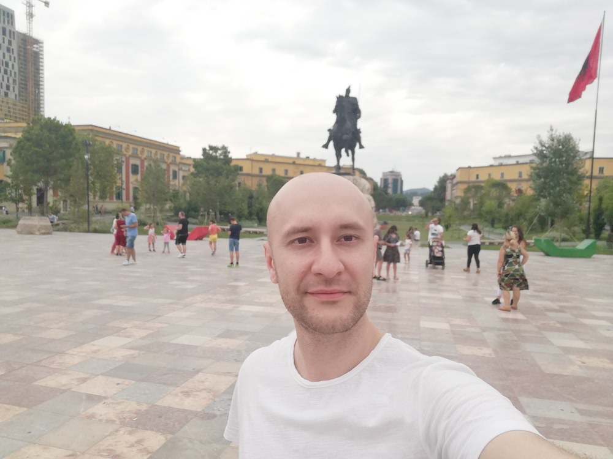

## 👨‍🦲 I am

### Marsel Atamuratov

Future Junior Frontend Developer 🤠

## 📮 Contact

 : mars#7989  
 : [iamrealmarsel](https://t.me/iamrealmarsel)  
 : [iamrealmarsel@gmail.com](mailto:iamrealmarsel@gmail.com)  
 : [iamrealmarsel](https://www.linkedin.com/in/iamrealmarsel)

## ✍️ About me

I am 35 y.o., I was born in Tashkent, but I moved to Moscow a long time ago and live here to this day

**Briefly about work experience and training in general (in chronological order):**

- have completed courses in html and css
- worked as an html-coder in a marketing agency for a year
- worked as a marketing manager in a financial company in Montenegro for a year and remotely for another year
- have completed courses in javascript and react, have created several training projects

**Briefly about development plan**

Primary Goals:

- employment as a Junior Frontend Developer
- basic learning backend development in order to understand full stack development
- learning English to be able to speak more than this annoying phrase "London is the capital of Great Britain" 😅

Secondary goals:

- learning Three.js library and Blender program to be able to do like Bruno Simon, very inspired by his creation 😍
- learning UX/UI design

Non-programming goals:

- learn how to play Go and maybe even to get 9 dan rank! ⚪️⚫️
- grow bonsai 🌳
- travel the whole world, well, or at least half 🌍

## 🦾 Skills

| name                   | level |
| ---------------------- | ----- |
| HTML, CSS, Sass, BEM   | ●●●●○ |
| Javascript             | ●●○○○ |
| React                  | ●●○○○ |
| Redux                  | ●○○○○ |
| Webpack                | ●○○○○ |
| Git                    | ●●○○○ |
| Figma                  | ●●●○○ |
| Tea drinking           | ●●●●● |

To be honest, I don't know how to properly evaluate my skills

## 🤖 Example code

```javascript
Object.defineProperty(Person.prototype, 'name', {
  set(name) {
    [this.firstName, this.lastName] = name.split(' ');
  },
  get() {
    return this.getName();
  },
});
```

## 🔬 Experience

I have completed some courses in html and css, javascript and react  
I worked as an html-coder in a marketing agency for one year

**Portfolio site**  
Here are collected educational projects on javascript programming and commercial projects on HTML coding

[**Portfolio**](https://marsel.one) |
[**Source Code**](https://github.com/iamrealmarsel/portfolio)  
Used skills: Create React App, React, React Router v6, Context API

**Some training projects from portfolio above**

[**What To Watch**](https://iamrealmarsel.github.io/151240-what-to-watch-5/public) |
[**Source Code**](https://github.com/iamrealmarsel/151240-what-to-watch-5)  
Used skills: React, React Router v5, Redux, Webpack

[**React Sneakers**](https://iamrealmarsel.github.io/projects/spa/react-sneakers/build) |
[**Source Code**](https://github.com/iamrealmarsel/projects/tree/main/spa/react-sneakers)  
Used skills: Create React App, React, React Router v5, Context API

## 🎓 Education

**Unfinished higher education**

Educational Institution: MGUPI  
Faculty: IT  
Specialization: Automated information processing and control systems

**Courses**

Educational Institution: HTML Academy  
[JavaScript. Architecture of Front-end Applications](https://assets.htmlacademy.ru/certificates/intensive/169/151240.pdf)  
[React. Development of Complex Front-end Applications](https://assets.htmlacademy.ru/certificates/intensive/171/151240.pdf)

Educational Institution: RS School 😍  
In progress...

## 🗺 Languages

🇷🇺 : native  
🇺🇸 : А1
